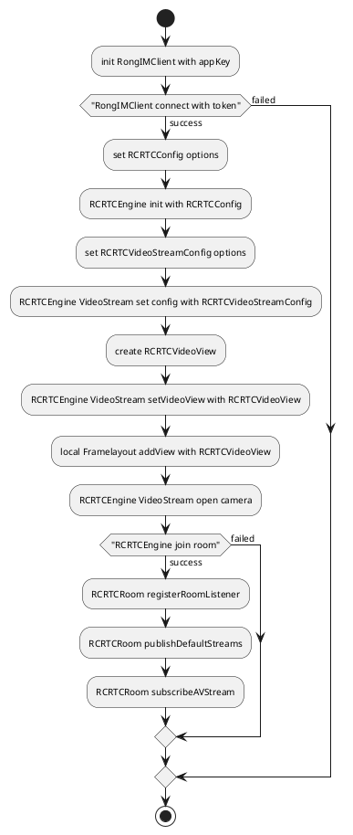

### 集成RTCLib视频会议流程图

```plantuml
@startuml
skinparam defaultFontName 微软雅黑
skinparam defaultFontSize 10
skinparam monochrome true
skinparam shadowing false

start
:init RongIMClient with appKey; 
if ("RongIMClient connect with token") then (success)
    :set RCRTCConfig options;
    :RCRTCEngine init with RCRTCConfig;
    :set RCRTCVideoStreamConfig options;
    :RCRTCEngine VideoStream set config with RCRTCVideoStreamConfig;
    :create RCRTCVideoView;
    :RCRTCEngine VideoStream setVideoView with RCRTCVideoView;
    :local Framelayout addView with RCRTCVideoView;
    :RCRTCEngine VideoStream open camera;
    if ("RCRTCEngine join room") then (success)
        :RCRTCRoom registerRoomListener;
        :RCRTCRoom publishDefaultStreams;
        :RCRTCRoom subscribeAVStream;
    else (failed)
    endif
else (failed)
endif
stop
@enduml

```
