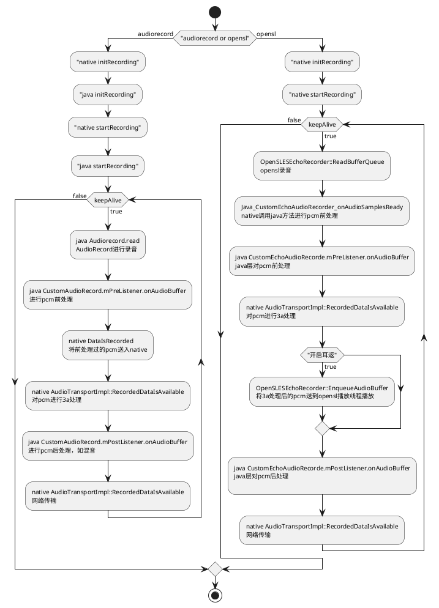

```plantuml

@startuml
skinparam defaultFontName 微软雅黑
skinparam defaultFontSize 10
skinparam monochrome true
skinparam shadowing false

start
 
if ("audiorecord or opensl") then (audiorecord)
    :"native initRecording";
    :"java initRecording";
    :"native startRecording";
    :"java startRecording";
    while (keepAlive) is (true)
    :java Audiorecord.read 
    AudioRecord进行录音;
    :java CustomAudioRecord.mPreListener.onAudioBuffer 
    进行pcm前处理;
    :native DataIsRecorded 
    将前处理过的pcm送入native;
    :native AudioTransportImpl::RecordedDataIsAvailable 
    对pcm进行3a处理;
    :java CustomAudioRecord.mPostListener.onAudioBuffer  
    进行pcm后处理，如混音;
    :native AudioTransportImpl::RecordedDataIsAvailable 
    网络传输;
    endwhile (false)
else  (opensl)
    :"native initRecording";
    :"native startRecording";
    while (keepAlive) is (true)
    :OpenSLESEchoRecorder::ReadBufferQueue
    opensl录音;
    :Java_CustomEchoAudioRecorder_onAudioSamplesReady
    native调用java方法进行pcm前处理;
    :java CustomEchoAudioRecorde.mPreListener.onAudioBuffer
    java层对pcm前处理;
    :native AudioTransportImpl::RecordedDataIsAvailable 
    对pcm进行3a处理;
    if ("开启耳返") then (true)
    :OpenSLESEchoRecorder::EnqueueAudioBuffer
    将3a处理后的pcm送到opensl播放线程播放 ;
    endif
    :java CustomEchoAudioRecorde.mPostListener.onAudioBuffer
    java层对pcm后处理
    ;
    :native AudioTransportImpl::RecordedDataIsAvailable 
    网络传输;
    endwhile (false)
endif
stop
@enduml
```